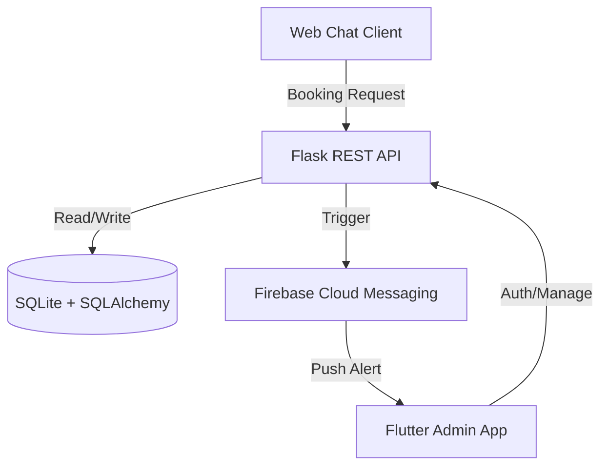

# ARCHITECTURE - Systems Overview

## Design Philosophy

**Klipper** follows an **API-First, Hybrid-Client architecture**. The system is designed to be a "Triad" that balances administrative control with client accessibility.

---

## 1. The Core: Backend (Python/Flask)

A modular, stateless REST API serving three distinct purposes:
- **Admin API**: Secure endpoints for management tasks (Customers, Schedules, Finance).
- **Public API**: Low-friction endpoints for the Web Chat client.
- **Static Host**: Serving the lightweight Web Chat interface.

### Layers
- **ORM (SQLAlchemy)**: High-level data abstraction.
- **Service Layer (Blueprints)**: Domain-specific logic separation (Auth, Public, Admin).
- **Notification Manager**: Fire-and-forget orchestration of FCM pushes.

---

## 2. The Pilot: Admin App (Flutter)

A cross-platform native application for the business owner.
- **State Management**: Provider (ChangeNotifier) pattern.
- **Persistence**: SharedPreferences for secure JWT storage.
- **Feature Focus**: Real-time push alerts, schedule visualization, and data entry.

---

## 3. The Scout: Web Chat (Client UI)

A zero-barrier web interface for the end customer.
- **Pattern**: Polling / Event-driven booking.
- **Interface**: Modern conversational UI (CSS Glassmorphism).
- **Objective**: High-speed booking with automated data piping to the Backend.

---

## Data Flow Diagram

---

## Security Architecture

- **Auth Strategy**: JWT (JSON Web Token) with 24h validity.
- **Route Guarding**: Custom decorators `@token_required` ensure the Admin API remains exclusive.
- **Data Privacy**: Sensitive credentials (Firebase keys, Secret keys) are managed via Environment Variables (.env) and never committed to source.

---

## Scalability Path

By using SQLAlchemy and a decoupled REST architecture, **Klipper** is ready to:
1. Swap SQLite for PostgreSQL/MySQL without logic changes.
2. Scale the Web Chat and Admin App independently.
3. Integrate with payment gateways or external calendars in future milestones.